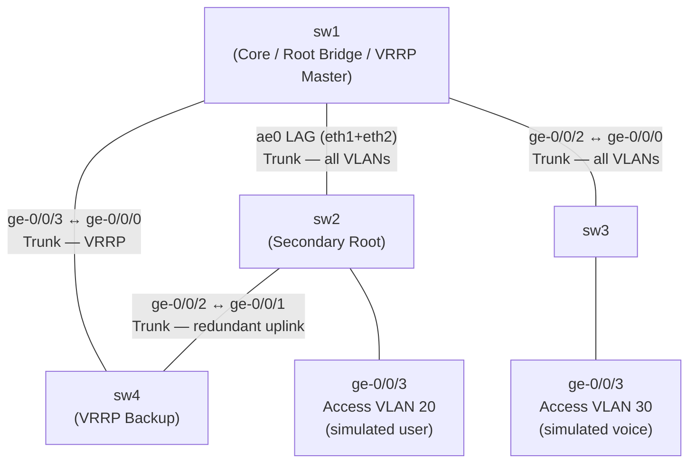

# Challenge Lab — Campus Layer 2 Design

No step-by-step commands. Design and implement the solution yourself.

## Deploy

```bash
cd ~/development/github/junos-labs
sudo containerlab deploy -t layer2-lab.clab.yml
```

Hostnames and SSH are pre-configured. Everything else is up to you.

---

## Scenario

You are deploying a new campus switching infrastructure. The network must be resilient, support multiple VLANs, and provide redundant Layer 3 gateway services.

Use the 4-switch topology: sw1, sw2, sw3, sw4.

---

## Requirements

### VLANs

Define the following VLANs on all switches before assigning them to any interfaces:

| VLAN | Name | ID | Subnet |
|------|------|----|--------|
| Management | MGMT | 10 | 10.10.10.0/24 |
| Users | USERS | 20 | 10.10.20.0/24 |
| Voice | VOICE | 30 | 10.10.30.0/24 |

---

### Switching Topology



- sw1 is the **core/distribution switch** — all other switches uplink to sw1
- sw1–sw2: **LACP link aggregation** (ae0) using both eth1 and eth2 — LACP must be active on at least one side; ae0 must carry all three VLANs as a trunk
- sw1–sw3: trunk carrying all three VLANs (single link)
- sw1–sw4: trunk carrying all three VLANs (single link, for VRRP)
- sw2–sw4: trunk carrying all three VLANs (redundant uplink to sw4)
- sw3 ge-0/0/3: access port in VLAN 30 (simulated voice endpoint)
- sw2 ge-0/0/3: access port in VLAN 20 (simulated user endpoint)

---

### Spanning Tree

- Use RSTP
- sw1 must be the **root bridge** for all VLANs — configure its bridge priority accordingly
- sw2 should be the **secondary root** (second-lowest priority) in case sw1 fails
- Enable RSTP on all inter-switch trunk and LAG interfaces
- Verify that no unintended loops exist and identify which ports are in blocking/discarding state

---

### Inter-VLAN Routing (IRB)

Configure Layer 3 gateway interfaces on sw1 for the User and Management VLANs:

| Interface | VLAN | IP |
|-----------|------|----|
| irb.10 | MGMT (10) | 10.10.10.1/24 |
| irb.20 | USERS (20) | 10.10.20.1/24 |

Routing between VLAN 10 and VLAN 20 must work via sw1.

---

### VRRP Gateway Redundancy

Provide a redundant default gateway for the USERS VLAN (VLAN 20):

- Virtual IP: **10.10.20.254**
- sw1: Master, priority 200, preempt enabled
- sw4: Backup, priority 100, preempt enabled
- sw4 needs its own IRB IP on VLAN 20: **10.10.20.2/24**
- Use MD5 authentication for VRRP with key `vrrp-key`

---

## Success Criteria

When your implementation is complete, verify:

- [ ] `show vlans` — VLANs 10, 20, 30 present with correct IDs on all switches
- [ ] `show lacp interfaces ae0` on sw1 and sw2 — both member links **Active**
- [ ] `show spanning-tree bridge` — sw1 is root bridge
- [ ] `show spanning-tree bridge` on sw2 — second lowest priority
- [ ] `show spanning-tree interface` — port roles correct; redundant paths show Discarding
- [ ] `show interfaces irb terse` on sw1 — irb.10 and irb.20 up with correct IPs
- [ ] `show route 10.10.10.0/24` on sw1 — directly connected via irb.10
- [ ] `show route 10.10.20.0/24` on sw1 — directly connected via irb.20
- [ ] `show vrrp` on sw1 — **Master** for VLAN 20
- [ ] `show vrrp` on sw4 — **Backup** for VLAN 20
- [ ] VRRP failover test: disable irb.20 on sw1, confirm sw4 becomes Master, re-enable and confirm sw1 preempts
