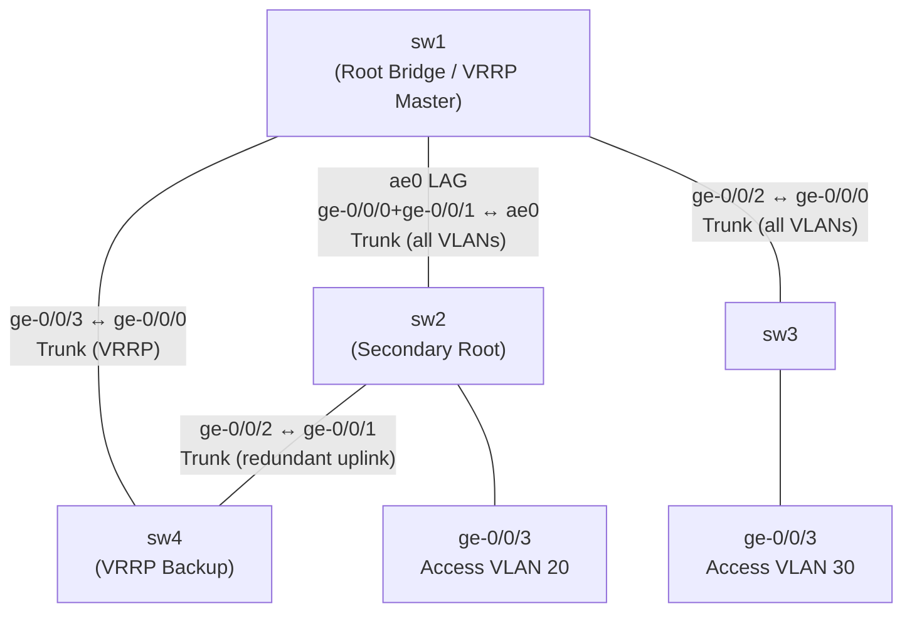

# Layer 2 Switching Lab

Covers VLANs, access/trunk ports, LACP, RSTP, IRB, and VRRP on a 4-switch QFX topology. Hostnames and SSH are pre-configured — everything else is configured manually.

---

## Deploy

```bash
cd ~/development/github/junos-labs
sudo containerlab deploy -t layer2-lab.clab.yml
```

SSH into nodes:
```bash
ssh admin@clab-layer2-lab-sw1
ssh admin@clab-layer2-lab-sw2
ssh admin@clab-layer2-lab-sw3
ssh admin@clab-layer2-lab-sw4
```

### Topology



| Link | sw1 Interface | Other Switch | Type |
|------|---------------|--------------|------|
| sw1–sw2 | ge-0/0/0 + ge-0/0/1 (ae0) | sw2 ae0 | LAG trunk |
| sw1–sw3 | ge-0/0/2 | sw3 ge-0/0/0 | Trunk |
| sw1–sw4 | ge-0/0/3 | sw4 ge-0/0/0 | Trunk (VRRP) |
| sw2–sw4 | ge-0/0/2 | sw4 ge-0/0/1 | Trunk (redundant uplink) |

**VLANs:** 10, 20, 30  
**IRB:** irb.10 = 192.168.10.1/24 (sw1 master), irb.20 = 192.168.20.1/24  
**VRRP group 10:** VIP 192.168.10.254, sw1 priority 200, sw4 priority 100

### Junos CLI Reminders
```
configure
show | compare
commit check
commit
rollback 1 ; commit
run show ...
```

---

---

## Section 1 — VLANs & Access/Trunk Ports

**Objective:** Create VLANs, assign access ports to a single VLAN, configure trunk ports to carry multiple VLANs.

### Task 1 — Create VLANs
Create VLANs 10, 20, and 30 on **all switches** (VLANs must exist before being assigned to interfaces).

```
set vlans VLAN10 vlan-id 10
set vlans VLAN20 vlan-id 20
set vlans VLAN30 vlan-id 30
commit
```

```
show vlans    # confirm VLANs present
```

### Task 2 — Configure Access Ports
Access ports carry a single untagged VLAN — used for end-host connections.

**On sw2 (ge-0/0/3 → VLAN 10):**
```
set interfaces ge-0/0/3 unit 0 family ethernet-switching interface-mode access
set interfaces ge-0/0/3 unit 0 family ethernet-switching vlan members VLAN10
commit
```

**On sw3 (ge-0/0/3 → VLAN 30):**
```
set interfaces ge-0/0/3 unit 0 family ethernet-switching interface-mode access
set interfaces ge-0/0/3 unit 0 family ethernet-switching vlan members VLAN30
commit
```

### Task 3 — Configure Trunk Ports
Trunk ports carry multiple VLANs with 802.1Q tags — used between switches.

**On sw1 (ge-0/0/2 → sw3):**
```
set interfaces ge-0/0/2 unit 0 family ethernet-switching interface-mode trunk
set interfaces ge-0/0/2 unit 0 family ethernet-switching vlan members [VLAN10 VLAN20 VLAN30]
commit
```

**On sw3 (ge-0/0/0 → sw1):**
```
set interfaces ge-0/0/0 unit 0 family ethernet-switching interface-mode trunk
set interfaces ge-0/0/0 unit 0 family ethernet-switching vlan members [VLAN10 VLAN20 VLAN30]
commit
```

```
show ethernet-switching interface    # mode and VLAN membership per interface
show vlans                           # interfaces listed under each VLAN
```

**Key Concepts:**
- Access port: untagged, single VLAN, for end hosts
- Trunk port: tagged with 802.1Q, multiple VLANs, between switches or switch-router
- VLANs must be defined (`set vlans`) before assignment

**Checklist:**
- [ ] `show vlans` — VLANs 10, 20, 30 present
- [ ] `show ethernet-switching interface` — correct mode and VLAN on each port

---

---

## Section 2 — LACP Link Aggregation

**Objective:** Bundle two physical links between sw1 and sw2 into a single logical LAG using LACP.

### Task 1 — Configure LAG on sw1

```
set chassis aggregated-devices ethernet device-count 1

set interfaces ge-0/0/0 ether-options 802.3ad ae0
set interfaces ge-0/0/1 ether-options 802.3ad ae0

set interfaces ae0 aggregated-ether-options lacp active
set interfaces ae0 aggregated-ether-options minimum-links 1
set interfaces ae0 unit 0 family ethernet-switching interface-mode trunk
set interfaces ae0 unit 0 family ethernet-switching vlan members [VLAN10 VLAN20 VLAN30]
commit
```

### Task 2 — Mirror Config on sw2

```
set chassis aggregated-devices ethernet device-count 1

set interfaces ge-0/0/0 ether-options 802.3ad ae0
set interfaces ge-0/0/1 ether-options 802.3ad ae0

set interfaces ae0 aggregated-ether-options lacp active
set interfaces ae0 unit 0 family ethernet-switching interface-mode trunk
set interfaces ae0 unit 0 family ethernet-switching vlan members [VLAN10 VLAN20 VLAN30]
commit
```

```
show lacp interfaces ae0          # both member links Active/Up
show interfaces ae0 detail        # aggregate link stats
show interfaces ge-0/0/0 detail   # member link LACP detail
```

**Key Concepts:**
- LAG (ae0) = logical bundle; `chassis aggregated-devices ethernet device-count` must be set first
- LACP `active` mode: initiates LACP negotiation; `passive` waits for partner
- `minimum-links 1`: LAG stays up even if one member fails

**Checklist:**
- [ ] `show lacp interfaces ae0` — both members Active/Up
- [ ] `show interfaces ae0` — aggregate shows combined bandwidth

---

---

## Section 3 — RSTP (Rapid Spanning Tree)

**Objective:** Elect sw1 as root bridge, understand port roles, observe blocked ports.

### Task 1 — Set Root Bridge Priority

Lower bridge priority = more likely to be elected root (default = 32768; must be multiple of 4096).

**On sw1 (make it root):**
```
set protocols rstp bridge-priority 4096
commit
```

**On sw2, sw3, sw4 (leave default or set explicitly):**
```
set protocols rstp bridge-priority 32768
commit
```

### Task 2 — Enable RSTP on Trunk/LAG Interfaces

**On sw1:**
```
set protocols rstp interface ge-0/0/2.0
set protocols rstp interface ge-0/0/3.0
set protocols rstp interface ae0.0
commit
```

Enable on corresponding interfaces on sw2, sw3, sw4.

```
show spanning-tree bridge       # bridge priority, root election status
show spanning-tree interface    # port role (Root/Designated/Alternate) and state
```

Expected:
- sw1 = root bridge (all ports Designated)
- sw2, sw3 = root port pointing toward sw1

**Key Concepts:**
- Root bridge: lowest bridge priority wins; tie-breaker is lowest MAC address
- Port roles: Root (toward root), Designated (away from root), Alternate (blocked redundant)
- RSTP converges in ~1s vs 30–50s for classic STP
- Bridge priority must be a multiple of 4096

**Checklist:**
- [ ] `show spanning-tree bridge` — sw1 is root (priority 4096)
- [ ] `show spanning-tree interface` — port roles correct, redundant path blocked (Discarding)

---

---

## Section 4 — IRB (Inter-VLAN Routing)

**Objective:** Configure Layer 3 gateway interfaces on VLANs for inter-VLAN routing on sw1.

### Task 1 — Bind IRB Interfaces to VLANs

**On sw1:**
```
set vlans VLAN10 l3-interface irb.10
set vlans VLAN20 l3-interface irb.20

set interfaces irb unit 10 family inet address 192.168.10.1/24
set interfaces irb unit 20 family inet address 192.168.20.1/24

set routing-options router-id 1.1.1.1
commit
```

```
show interfaces irb terse         # IRB interfaces up
show route 192.168.10.0/24        # directly connected via IRB
ping 192.168.10.1
```

**Traffic flow for inter-VLAN routing:**
Packet from VLAN 10 host → arrives untagged on access port → hit VLAN 10 IRB on sw1 → routed to VLAN 20 IRB → forwarded down to VLAN 20 segment.

**Key Concepts:**
- IRB = Integrated Routing and Bridging; provides an L3 interface for an L2 VLAN
- One IRB unit per VLAN (irb.10 for VLAN 10)
- Traffic must be bridged within a VLAN before hitting the IRB for routing

**Checklist:**
- [ ] `show interfaces irb terse` — irb.10 and irb.20 up with correct IPs
- [ ] `show route 192.168.10.0/24` — directly connected
- [ ] `ping 192.168.10.1` succeeds from sw1

---

---

## Section 5 — VRRP Gateway Redundancy

**Objective:** Configure sw1 and sw4 to share a virtual IP for VLAN 10. sw1 is Master, sw4 is Backup.

### Task 1 — Prepare sw4 for VLAN 10
sw4 needs to participate in VLAN 10 via a trunk port and have its own IRB IP.

**On sw4 (trunk toward sw1 on ge-0/0/0 and toward sw2 on ge-0/0/1):**
```
set vlans VLAN10 vlan-id 10
set interfaces ge-0/0/0 unit 0 family ethernet-switching interface-mode trunk
set interfaces ge-0/0/0 unit 0 family ethernet-switching vlan members VLAN10
set interfaces ge-0/0/1 unit 0 family ethernet-switching interface-mode trunk
set interfaces ge-0/0/1 unit 0 family ethernet-switching vlan members VLAN10

set vlans VLAN10 l3-interface irb.10
set interfaces irb unit 10 family inet address 192.168.10.2/24
commit
```

### Task 2 — Configure VRRP on sw1 (Master)

**On sw1:**
```
set interfaces irb unit 10 family inet vrrp-group 10 virtual-address 192.168.10.254
set interfaces irb unit 10 family inet vrrp-group 10 priority 200
set interfaces irb unit 10 family inet vrrp-group 10 preempt
set interfaces irb unit 10 family inet vrrp-group 10 authentication-type md5
set interfaces irb unit 10 family inet vrrp-group 10 authentication-key "vrrp-secret"
commit
```

### Task 3 — Configure VRRP on sw4 (Backup)

**On sw4:**
```
set interfaces irb unit 10 family inet vrrp-group 10 virtual-address 192.168.10.254
set interfaces irb unit 10 family inet vrrp-group 10 priority 100
set interfaces irb unit 10 family inet vrrp-group 10 preempt
set interfaces irb unit 10 family inet vrrp-group 10 authentication-type md5
set interfaces irb unit 10 family inet vrrp-group 10 authentication-key "vrrp-secret"
commit
```

```
show vrrp         # sw1 = Master, sw4 = Backup
show vrrp detail  # priority, state, virtual IP
```

### Task 4 — Test Failover

**On sw1:**
```
set interfaces irb unit 10 disable
commit
```

**On sw4:**
```
show vrrp    # should now show Master
```

Re-enable sw1's IRB — preempt is set so sw1 reclaims Master:
```
# On sw1:
delete interfaces irb unit 10 disable
commit
```

**Key Concepts:**
- VRRP: one Master + one or more Backup share a virtual IP (VIP)
- Highest priority = Master; preempt = higher-priority router reclaims Master when it recovers
- Clients use the VIP as their default gateway — invisible to them when failover occurs
- Authentication prevents rogue VRRP speakers

**Junos Switching vs Routing:**

| Feature | vRouter (MX) | vSwitch (QFX) |
|---------|-------------|---------------|
| Interface family | `family inet` | `family ethernet-switching` |
| VLANs | Not applicable | `set vlans` + IRB |
| L2 forwarding | No | Yes (MAC table) |
| STP | Not applicable | `protocols rstp/mstp` |

**Checklist:**
- [ ] `show vlans` — VLANs 10, 20, 30 with correct member interfaces
- [ ] `show ethernet-switching interface` — correct mode and VLAN per port
- [ ] `show lacp interfaces ae0` — both members Active
- [ ] `show spanning-tree bridge` — sw1 is root (priority 4096)
- [ ] `show interfaces irb terse` — IRB interfaces up with IPs
- [ ] `show vrrp` — sw1 Master, sw4 Backup
- [ ] VRRP failover: sw4 becomes Master when sw1 IRB disabled

---

## Teardown

```bash
sudo containerlab destroy -t layer2-lab.clab.yml
```

Save progress first if needed:
```bash
sudo containerlab save -t layer2-lab.clab.yml
```
